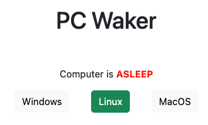

# PC Waker

Some code to turn a Raspberry Pi Zero W into an always-on companion that can launch my PC and also select which OS to boot into (by emulating a keyboard).



## Getting Started

These instructions will guide you though setting up a similar system for your own setup. I'm on the go quite often and would like to be able to take over my pc at all times. In most cases this is either ssh-ing in Linux for development, running mac and taking over for video editing or running windows and playing games from my laptop.

### My Setup Details

My own setup is a bit of a mess:
- PC (Dual Booting Linux and Windows)
- An M1 Mac Mini
- An old Synology NAS
- My homelab PC

For now I'm focusing on the first 2, with the other 2 following later on.

### Step 1: Enabeling WOL on your devices

Wake On LAN (WOL) is awesome because you can boot your PC by simply sending a network packet to it using its network card MAC Address. Enable this on all the devices you want to be remotely bootable.
However, Windows 11 refused to work with me. I went through all the tutorials and set all the settings. Linux would work perfectly fine, but when I shut down using Windows, the network card was always disabled as well. It should be easy, yet it isn't. Forum posts are scarce and when I did find one post that exactly matched my issues, Microsoft claimed it was the hardware (which obviously it wasn't because Linux worked just fine).

So I ended up attaching a relay to my Pi and created some split wires to allow me to boot my PC both with the power button or with the relay.

### Step 2: Setting up the PI to work as a USB Keyboard

For this step, I simply followed [this tutorial](https://randomnerdtutorials.com/raspberry-pi-zero-usb-keyboard-hid/).

## Step 3: Setting up the code in this repo

The code in this repo is super simple. It creates a Flask server that server a neat little webpage, with some buttons to boot my machines and an indicator of whether the PC is alive or not. (Mac alive ping not yet implemented.)

The final server will need root access though to be able to emulate the keyboard, so make sure to install the dependencies in the root environment (by using sudo) instead of your user's env.

```
$ sudo pip install requirements
$ sudo python wake_pc_flask.py
```

## Step 4: Deploy as a systemd service

To keep the service running, keep logs rotated and be sure it restarts every time, I let chatGPT make me a systemd service file that lives in `/etc/systemd/system`:

```
pi@raspberrypi:~ $ cat /etc/systemd/system/pc_waker.service
[Unit]
Description=Wake PC

[Service]
User=root
WorkingDirectory=/home/pi/pc_waker
ExecStart=gunicorn -w 1 -b 0.0.0.0 --timeout 360 'wake_pc_flask:app'
Restart=always

[Install]
WantedBy=multi-user.target
```

The `-b 0.0.0.0` is needed so it allows other machines than localhost to reach the server.
`--timeout 360` corresponds to the API that mashes F11 for 2 minutes before picking a boot option. Otherwise the worker will be killed.

### Step 5: Make it accessible

To be able to reach this server from everywhere, I chose for [Zerotier](https://www.zerotier.com), a free and open source, p2p tunneling VPN(-ish)
